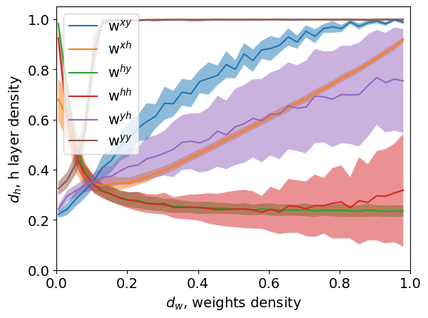
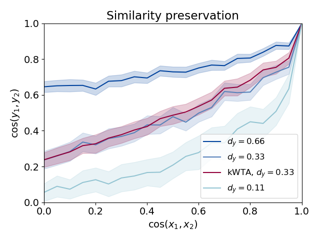
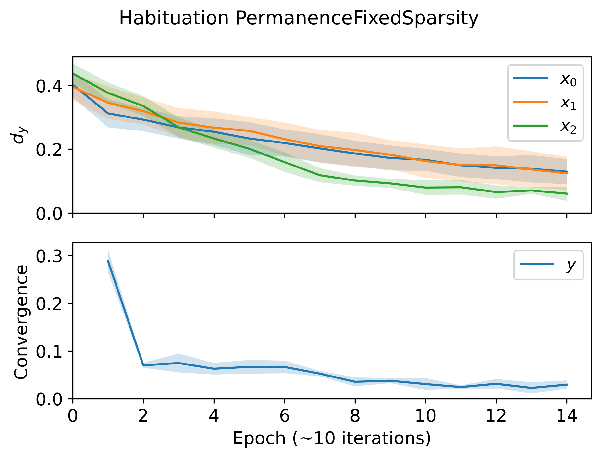
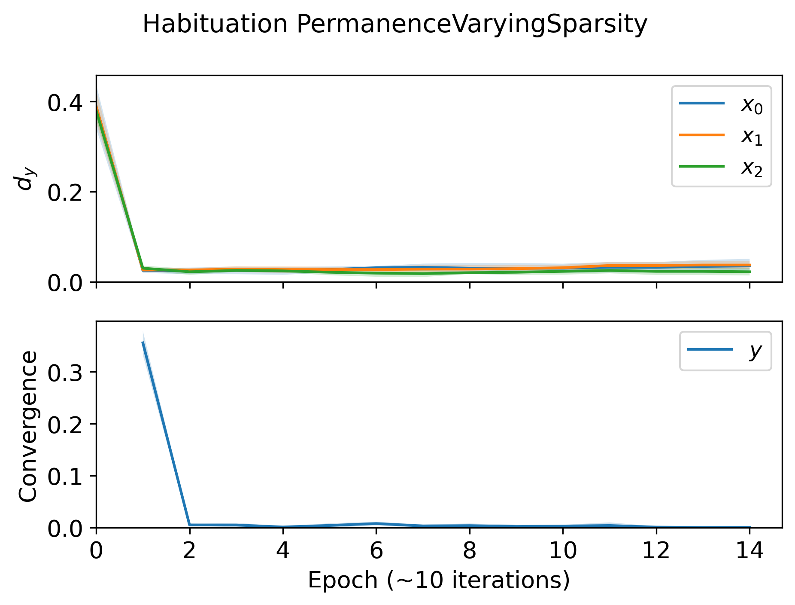
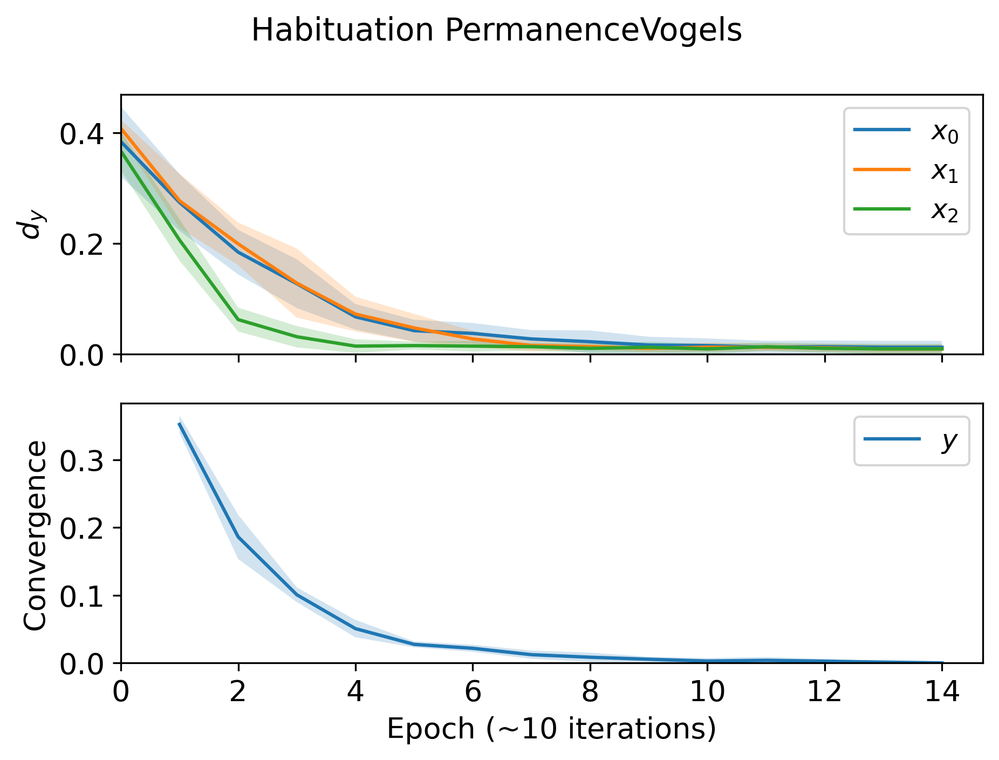
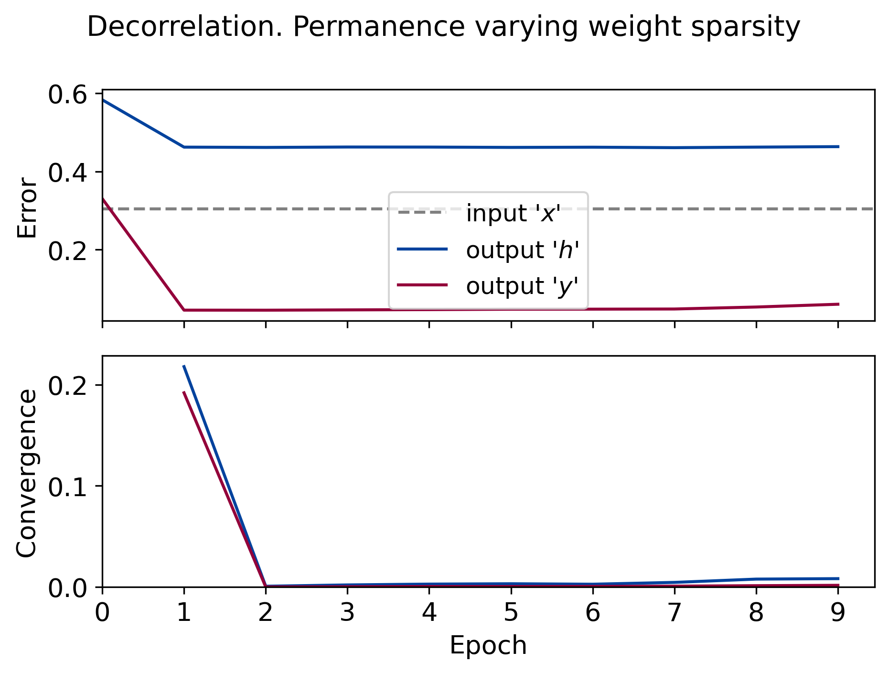
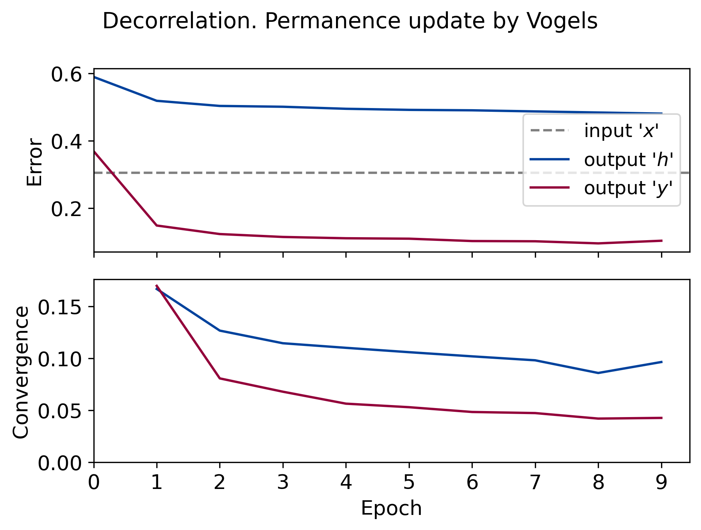
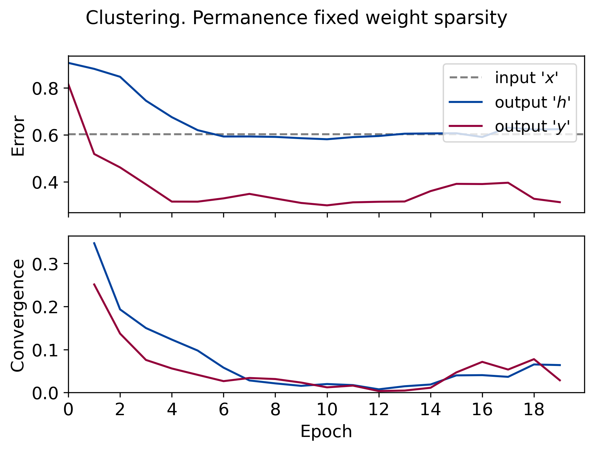
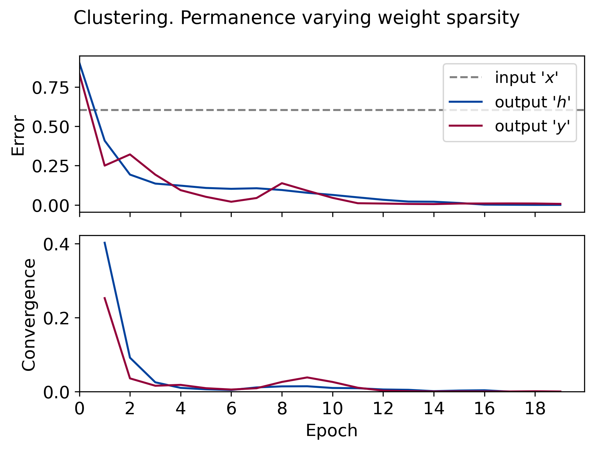
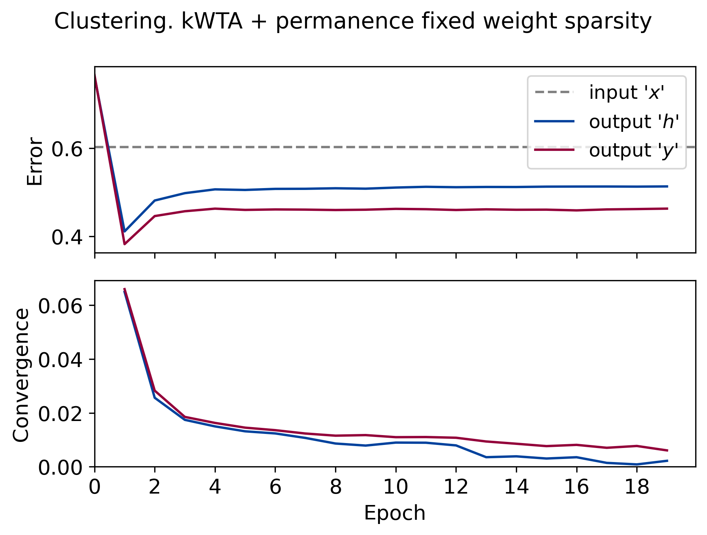

# Iterative winners-take-all

This repository contains Python implementation of our paper

**FORMATION  OF CELL ASSEMBLIES WITH ITERATIVEWINNERS-TAKE-ALL COMPUTATION ANDEXCITATION–INHIBITION  BALANCE**

available on arxiv at https://arxiv.org/abs/2108.00706.

## Quick start

Python 3.6+ is required.

First, install the [requirements](./requirements.txt):
```
pip install -r requirements.txt
```

Then you're ready to run the scripts to reproduce the figures in the paper.

For PyTorch implementation, refer to the [`nn`](./nn) directory.

Should you have any questions, please [open an issue](https://github.com/KyivAIGroup/iterative-winners-take-all/issues) or email us.

## Reproducing the figures

To reproduce the plots, run `python figX.py` in a terminal, where `figX.py` is one of the following:

* [`fig2.py`](./fig2.py) - how the output populations sparsity depends on the weight sparsity (weights are random fand fixed);
* [`fig2c.py`](./fig2c.py) - dependence on the input sparsity (not shown in the paper);
* [`similarity_preservation`](./similarity_preservation.py) - similarity preservation (not show in the paper);
* [`fig3b.py`](./fig3b.py) - habituation;
* [`fig4.py`](./fig4.py) - clustering;
* [`decorrelation.py`](./decorrelation.py) - decorrelation (not shown in the paper).

This section compiles all figures, listed and supplementary, in one page.

### Figure 2. Dependence of the sparsity of encodings on the weight sparsity

The weights are random and fixed.

<table style="width:100%">
    <tr>
        <td>
            
        </td>
        <td>
            
        </td>
    </tr>
</table>

### Dependence on the input sparsity


### Similarity preservation

Similar input are encoded in similar output populations.




The figures from the next sections involve learning. *Learning* the weights means letting the network evolve over time from input stimuli `x` rather than "training" it from labelled data. In other words, the learning is local and unsupervised.


### Habituation

<table style="width:100%">
    <tr>
        <td>
            
        </td>
        <td>
            
        </td>
        <td>
            
        </td>
		<td>
            
        </td>
    </tr>
</table>

### Decorrelation

<table style="width:100%">
    <tr>
        <td>
            
        </td>
        <td>
            
        </td>
        <td>
            
        </td>
		<td>
            
        </td>
		<td>
            
        </td>
    </tr>
</table>


### Clustering

<table style="width:100%">
    <tr>
        <td>
            
        </td>
        <td>
            
        </td>
        <td>
            
        </td>
		<td>
            
        </td>
		<td>
            
        </td>
    </tr>
</table>
