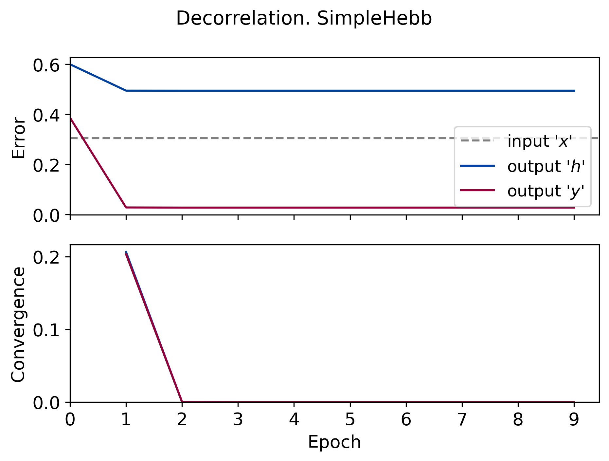
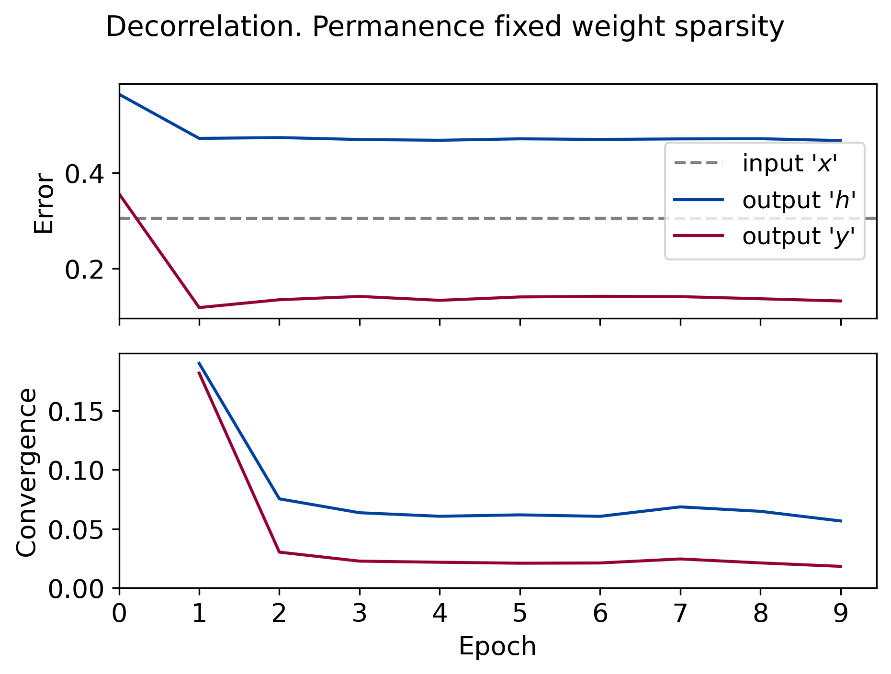
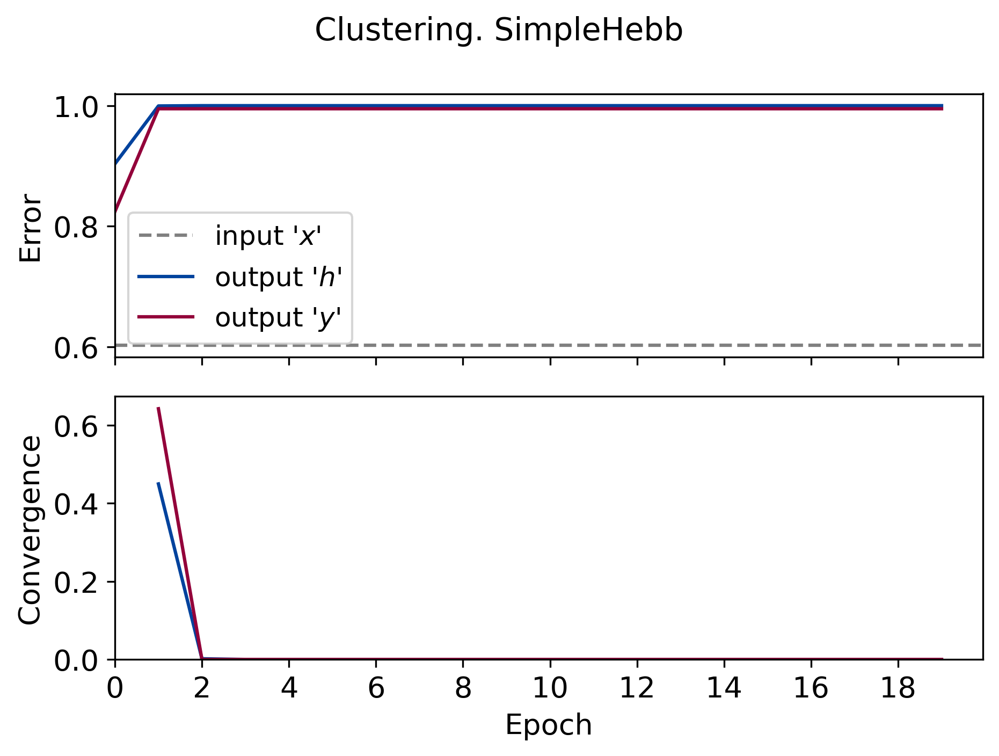

# Iterative winners-take-all

This repository contains Python implementation of our paper:

> FORMATION  OF CELL ASSEMBLIES WITH ITERATIVEWINNERS-TAKE-ALL COMPUTATION ANDEXCITATION–INHIBITION  BALANCE

For PyTorch implementation, refer to the [`nn`](./nn) directory.

## Quick start

Python 3.6+ is required.

First, install the [requirements](./requirements.txt):
```
pip install -r requirements.txt
```

Then you're ready to run the scripts to reproduce the figures in the paper.

Should you have any questions, please [open an issue](https://github.com/KyivAIGroup/iterative-winners-take-all/issues) or send an email to us.

## Reproducing the figures

To reproduce the plots, run `python figX.py` in a terminal, where `figX.py` is one of the following:

* [`fig2.py`](./fig2.py) - how the output populations sparsity depends on the weight sparsity (weights are random fand fixed);
* [`fig3b.py`](./fig3b.py) - habituation;
* [`fig4.py`](./fig4.py) - clustering;
* [`decorrelation.py`](./decorrelation.py) - decorrelation (the figures are not shown in the paper).

This section compiles all figures, listed and supplementary, in one page.

### Habituation

<table style="width:100%">
    <tr>
        <td>
            
        </td>
        <td>
            
        </td>
        <td>
            
        </td>
		<td>
            
        </td>
    </tr>
</table>

### Decorrelation

<table style="width:100%">
    <tr>
        <td>
            
        </td>
        <td>
            
        </td>
        <td>
            
        </td>
		<td>
            
        </td>
		<td>
            
        </td>
    </tr>
</table>


### Clustering

<table style="width:100%">
    <tr>
        <td>
            
        </td>
        <td>
            
        </td>
        <td>
            
        </td>
		<td>
            
        </td>
		<td>
            
        </td>
    </tr>
</table>
